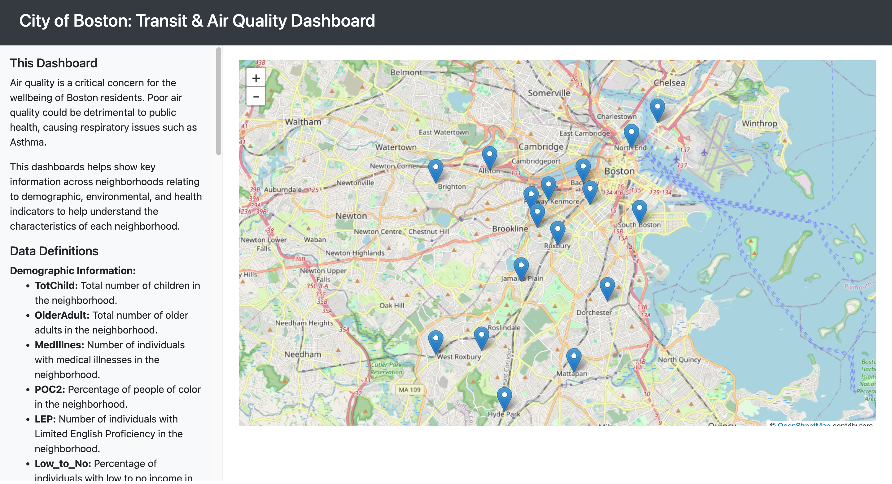

# Boston Air Quality & Transit Team F 
Clearing the Path: Evaluating Air Quality and Sustainable Transportation

## Problem Statement
Air quality is a critical concern for the wellbeing of Boston residents. Poor air quality could be detrimental to public health, causing respiratory issues such as Asthma. To address the issue of air quality around Boston, we are looking at how public transportation can play a crucial role in reducing emissions and increasing air quality. We aim to look at Boston divided into neighborhoods and see the factors behind the variability in air quality to help make guided decisions on where to focus efforts and policies to enhance air quality.

## Accessing the Code

- Each folder contains the code for processing its relevant dataset and consolidation of code to match greater requirements.
- In the Google AQI folder, the analysis.ipynb contains most of the graph based analysis 
- In the Extension folder, the extensionanalysis.ipynb contains most of the graph based analysis, with some other files that answer other specific questions. Additionally, you can see the relevant extension datasets in this folder.
- DataByNeighborhood.csv has a consolidated csv by neighborhood of all information.
- VisualMap.html has a consolidated visual overview of the same data in DataByNeighborhood.csv. This can also be seen a cleaner format on our [Dashboard Website](https://hemanshubhojwani.com/cs506dashboard)

Visit: https://hemanshubhojwani.com/cs506dashboard

## Contributors:
[Hemanshu Bhojwani](https://github.com/hemanshu-bhojwani), [Anulika Nnadi](https://github.com/aonnadi), [Ziliang Wang](https://github.com/Ziliang4936), [Xinzhu (Simon) Liang](https://github.com/XinzhuLiang), 